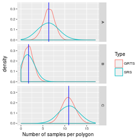
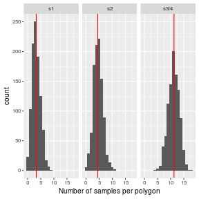

```{r knitr, include=FALSE}
library(knitr)
opts_chunk$set(
  echo = FALSE,
  message = FALSE
)
```

```{r setup}
n <- 19
reps <- 1000

library(GRTS)
library(xtable)
library(plyr)
library(ggplot2)
library(reshape)
library(sp)
theme_set(theme_grey(10))
options(width = 60)
options(str = strOptions(strict.width = "cut"))
foo <- packageDescription("GRTS")
update_geom_defaults("text", list(size = 3))
```

## Short introduction to Generalized Random Tessellation Stratified sampling (GRTS)

### Quandrant recursive map

A key component of GRTS is translating 2D coordinates to 1D coordinates. This is done by quandrant recursive maps [@Stevens_Olsen_1999; @Stevens_Olsen_2004]. The map is split in 4 quadrants by splitting it halfway along the north-south axis and halfway along the east-west axis. This yields the level-1 split. Each quadrant of level-1 is in a similar way split into 4 subquadrants. This yields 16 level-2 quadrants. This is recursively applied until each quadrant contains only one element or the dimensions of the quadrants are small enough. We give an example with three levels in figure~\ref{fig:QuandrantRecursive}.

```{r QuandrantRecursive, fig.cap = "Example of a quandrant recursive map with three levels."}
dataset <- expand.grid(x = 0:7, y = 0:7)
dataset$L1 <- 2 * dataset$x %/% 4 + dataset$y %/% 4
dataset$L2 <- 2 * dataset$x %/% 2 %% 2 + dataset$y %/% 2 %%2
dataset$L3 <- 2 * dataset$x %% 2 + dataset$y %% 2
positions <- rbind(
  c(1, 1),
  c(1, 2), 
  c(2, 2),
  c(2, 1),
  c(1, 1)
)
L1 <- ddply(dataset, .(L1), function(z){
  bounding <- apply(z[, c("x", "y")], 2, range)
  bounding <- bounding + rbind(c(-0.5, -0.5), c(0.5, 0.5))
  cbind(
    x = bounding[positions[, 1], 1],
    y = bounding[positions[, 2], 2],
    xm = mean(z$x),
    ym = mean(z$y)
  )
})
L2 <- ddply(dataset, .(L1, L2), function(z){
  bounding <- apply(z[, c("x", "y")], 2, range)
  bounding <- bounding + rbind(c(-0.5, -0.5), c(0.5, 0.5))
  cbind(
    x = bounding[positions[, 1], 1],
    y = bounding[positions[, 2], 2],
    xm = mean(z$x),
    ym = mean(z$y)
  )
})
L3 <- ddply(dataset, .(L1, L2, L3), function(z){
  bounding <- apply(z[, c("x", "y")], 2, range)
  bounding <- bounding + rbind(c(-0.5, -0.5), c(0.5, 0.5))
  cbind(
    x = bounding[positions[, 1], 1],
    y = bounding[positions[, 2], 2],
    xm = mean(z$x),
    ym = mean(z$y)
  )
})
L1$Index <- L1$L1
L2$Index <- L2$L2
L3$Index <- L3$L3
L1$Level <- 1
L2$Level <- 2
L3$Level <- 3
L1$Grouping <- with(L1, paste0(L1))
L2$Grouping <- with(L2, paste0(L1, L2))
L3$Grouping <- with(L3, paste0(L1, L2, L3))
L1$RevGrouping <- with(L1, paste0(L1))
L2$RevGrouping <- with(L2, paste0(L2, L1))
L3$RevGrouping <- with(L3, paste0(L3, L2, L1))
L1$Base10 <- with(L1, L1)
L2$Base10 <- with(L2, (L1 * 4) + L2)
L3$Base10 <- with(L3, ((L1 * 4) + L2) * 4 + L3)
L1$Base10Rev <- with(L1, L1)
L2$Base10Rev <- with(L2, (L2 * 4) + L1)
L3$Base10Rev <- with(L3, ((L3 * 4) + L2) * 4 + L1)
vars <- c("x", "y", "Grouping", "RevGrouping", "Index", "Level", "xm", "ym", "Base10", "Base10Rev")
polygons <- rbind(
  L1[, vars],
  L2[, vars],
  L3[, vars]
)
polygons$TextLevel <- factor(polygons$Level + 3, levels = 1:6)
polygons$Level <- factor(polygons$Level)
ggplot(polygons, aes(x = x, y = y, group = Grouping, colour = Level, label = Index)) + 
  geom_polygon(fill = NA, aes(size = Level)) + 
  geom_text(aes(x = xm, y = ym, size = TextLevel), show.legend = FALSE) + 
  coord_fixed() + 
  scale_size_manual(values = c(6, 3.5, 1, 16, 8, 4), guide = "none") +
  theme(
    axis.title = element_blank(),
    axis.text = element_blank(),
    axis.ticks = element_blank()
  )
```

### Reverse hierarchical ordering

We index each subquadrant within a quandrant uniquely with the numbers 0, 1, 2 or 3 (figure~\ref{fig:QuandrantRecursive}). The combination of this index with the indices of all lower levels gives a unique 1D address to each subquadrant. The level-1 quadrants need only 1 index, the level-2 quadrants require 2 indices (level-1 and level-2), ...

The 1D address can be though of as a base-4 number. In a typical hierarchical order we would use level-1 as the highest digit, level-2 as the next digit, and so on. Figure~\ref{fig:QuandrantRecursiveBase10} shows the base-4 indices up to the third level. The background of each cell is coloured along a gradient of address (after conversion to base-10). The change in colour clearly reflects the level-1 structure. 
Adding 1 to the lowest digit (level-3 in this example), results in 3 out of 4 times in moving to a neighouring cell. In other cases we would go to a cell in a neighbouring quadrant of a higher level. Thus the 1D address of neighbouring cells will be similar.

```{r QuandrantRecursiveBase10, fig.cap = "Example of a quandrant recursive map with three levels and base-4 indices."}
ggplot(
  subset(polygons, Level == 3), 
  aes(x = x, y = y, group = Grouping, label = Grouping)
) + 
  geom_polygon(aes(fill = Base10), show.legend = FALSE) + 
  geom_text(aes(x = xm, y = ym)) + 
  coord_fixed() + 
  theme(
    axis.title = element_blank(),
    axis.text = element_blank(),
    axis.ticks = element_blank()
  )
```

The picture changes if we reverse the hierarchical order (fig.~\ref{fig:QuandrantRecursiveBase10Rev}). Now we use level-1 as the lowest digit, level-2 as the second lowest digit, and so on. 

Adding 1 to the lowest digit, will now result in moving to another level-1 quadrant. Hence the corresponding movement in 2D is always large.

```{r QuandrantRecursiveBase10Rev, fig.cap = "Example of a quandrant recursive map with three levels and reverse hierarchical base-4 indices."}
ggplot(
  subset(polygons, Level == 3), 
  aes(x = x, y = y, group = RevGrouping, label = RevGrouping, fill = Base10Rev)
) + 
  geom_polygon(show.legend = FALSE) + 
  geom_text(aes(x = xm, y = ym), show.legend = FALSE) + 
  coord_fixed() + 
  theme(
    axis.title = element_blank(),
    axis.text = element_blank(),
    axis.ticks = element_blank()
  )
```

### Randomisation

The randomisation is done by permuting the indices of subquadrant. Each split of a quadrant in 4 subquadrants uses an independent random permutation.

### Selection of the sample

The actual selection of the sample from the 1D address come in two flavours. The oldest flavour [@Stevens_Olsen_1999] uses the normal hierarchical ordering. The acutal sample uses a systematic sampling along the 1D addresses. It samples every $N/n$ 1D address and uses a random start between $0$ and $N/n - 1$. 

A more recent flavour [@Stevens_Olsen_2004, @Stevens_Olsen_2003, @Theobald_etal_2007], is based on the reverse hierarchical ordering. The actual sample uses the first $n$ 1D addresses.

#### Benefits of the normal hierarchical order

- Unequal probablity sampling is easy to implent. Consider each 1D address to be a line segment with length proportional to inclusion probability. Concatenate all line segments according to the order of the 1D address. Take a systematic sample along this concatenated line.

#### Benefits of the revese hierarchical order

- Replacement of drop-out samples is easy. Just take the next available 1D address.
- Repeated sampling in time is possible, provided the entire region is covered as a GRTS grid. 


 

## Our implementation of GRTS

For the sake of simplicity we assume that we have a square grid with 8 rows and 8 columns and we would like to take a spatially balanced sample of `r n` grid cells. Each grid cell has a unique set of [2D coordinates](#tab:2D): the row id and the column id.

```{r results = "asis"}
tmp <- matrix(
  paste("(", rep(7:0, 8), ",", rep(0:7, each = 8), ")", sep = ""), 
  ncol = 8, 
  nrow = 8
)
print(
  type = "html",
  xtable(
    tmp, 
    align = "r|rrrrrrrr|", 
    label = "tab:2D", 
    caption = "2D coordinates of a 8 x 8 matrix"
  ), 
  include.rownames = FALSE, 
  include.colnames = FALSE, 
  hline.after = c(0, 8)
)
```

### Coding of 2D coordinates into 1D address

We start the convertion by splitting the matrix in 4 submatrices (level 1). We split it in half along the x-axis and in half along the y-axis. A single binary digit for each axis is sufficient to give each submatrix a [unique 2D code](#tab:Level1_2D).

```{r results = "asis"}
tmp <- matrix(
  paste(
    "(", 
    rep(rep(1:0, each = 4), 8), 
    ",", 
    rep(rep(0:1, each = 4), each = 8), 
    ")", 
    sep = ""
  ), 
  ncol = 8, 
  nrow = 8
)
print(
  xtable(
    tmp, 
    align = "r|rrrr|rrrr|", 
    label = "tab:Level1_2D", 
    caption = "Binary 2D codes for the first level of submatrices."
  ), 
  include.rownames = FALSE, 
  include.colnames = FALSE, 
  hline.after = c(0, 4, 8),
  type = "html"
)
```

Instead of a two digit binary (base 2) code, we can use a single base 4 code: [a number from 0 to 3](#Level1_1D).

```{r results='asis'}
tmp <- matrix(
  c(rep(rep(c(1, 0), each = 4), 4), rep(rep(c(3, 2), each = 4), 4)), 
  ncol = 8, 
  nrow = 8
)
print(
  xtable(
    tmp, 
    align = "r|rrrr|rrrr|", 
    digits = 0, 
    label = "tab:Level1_1D", 
    caption = "Base 4 1D codes for the first level of submatrices."
  ), 
  include.rownames = FALSE, 
  include.colnames = FALSE, 
  hline.after = c(0, 4, 8), 
  type = "html"
)
```

The next step is to split each submatrix again in each four subsubmatrices (level 2). Like before we number them from [0 to 3](#Level2_1D). Next we prepend this number to the [code of the submatrices](#tab:Level2_1Dc).

```{r results='asis'}
tmp2 <- matrix(
  c(rep(rep(c(1, 0), each = 2), 4), rep(rep(c(3, 2), each = 2), 4)), 
  ncol = 8, 
  nrow = 8
)
print(
  xtable(
    tmp2, 
    align = "r||rr|rr||rr|rr||", 
    digits = 0, 
    label = "tab:Level2_1D", 
    caption = "Base 4 1D codes for the second level of submatrices."
  ), 
  include.rownames = FALSE, 
  include.colnames = FALSE, 
  hline.after = c(0, 0, 2, 4, 4, 6, 8, 8),
  type = "html"
)
print(
  xtable(
    matrix(sprintf("%02i", 10 * tmp2 + tmp), ncol = 8), 
    align = "r||rr|rr||rr|rr||", 
    label = "tab:Level2_1Dc", 
    caption = 
      "Prepending the base 4 1D codes for the second level of submatrices to the
      base 4 1D codes for the first level of submatrices."
  ), 
  include.rownames = FALSE, 
  include.colnames = FALSE, 
  hline.after = c(0, 0, 2, 4, 4, 6, 8, 8),
  type = "html"
)
```

We keep repeating this procedure until all submatrices contain only one gridcell. In this example we have to do it only once more, resulting in the [third level 1D codes](#tab:Level3_1D) and the [combined codes](#tab:Level3_1Dc). When the matrix is square and the number of rows is a power of two, the procedure will take the same number of steps for each submatrix.

```{r results='asis'}
tmp3 <- matrix(c(rep(1:0, 4), rep(3:2, 4)), ncol = 8, nrow = 8)
print(
  xtable(
    tmp3, 
    align = "r||rr|rr||rr|rr||", 
    digits = 0, 
    label = "tab:Level3_1D", 
    caption = "Base 4 1D codes for the third level of submatrices."
  ), 
  include.rownames = FALSE, 
  include.colnames = FALSE, 
  hline.after = c(0, 0, 2, 4, 4, 6, 8, 8),
  type = "html"
)
print(
  xtable(
    matrix(sprintf("%03i", 100 * tmp3 + 10 * tmp2 + tmp), ncol = 8), 
    label = "tab:Level3_1Dc", 
    caption = "Combining the base 4 1D codes from all levels.", 
    align = "r||rr|rr||rr|rr||"
  ), 
  type = "html", 
  include.rownames = FALSE, 
  include.colnames = FALSE, 
  hline.after = c(0, 0, 2, 4, 4, 6, 8, 8)
)
```

### Randomisation

We randomise the above procedure at the point were we assign the number to the submatrices. Instead of assigning the numbers 0 to 3 in a systematic fashion, we do it at random. First we give an example for a 4 x 4 matrix. The randomised base 4 1D code for the [level 1](#tab:Ex4L1) and [level 2](#tab:Ex4L2) submatrices. These are  combined into a [unique code per grid cell](#tab:Ex4LC). The [order of the grid cells](#tab:Ex4L) is based on their [code](#tab:Ex4LC). This order or ranking is what the `QuadratRanking()` function returns.

```{r results='asis'}
tmp <- GRTS(4)
tmp2 <- tmp %/% 4
tmp1 <- tmp %% 4
print(
  xtable(
    tmp1, 
    digits = 0, 
    align = "r|rr|rr|", 
    label = "tab:Ex4L1", 
    caption = "Level 1 submatrices with randomised base 4 1D code."
  ),
  type = "html", 
  include.rownames = FALSE, 
  include.colnames = FALSE, 
  hline.after = c(0, 2, 4)
)
print(
  xtable(
    tmp2, 
    digits = 0, 
    align = "r|rr|rr|", 
    label = "tab:Ex4L2", 
    caption = "Level 2 submatrices with randomised base 4 1D code."
  ), 
  type = "html",
  include.rownames = FALSE, 
  include.colnames = FALSE, 
  hline.after = c(0, 2, 4)
)
print(
  xtable(
    matrix(sprintf("%02i", 10 * tmp2 + tmp1), ncol = 4), 
    align = "r|rr|rr|", 
    label = "tab:Ex4LC", 
    caption = "Combined base 4 1D codes."
  ), 
  type = "html",
  include.rownames = FALSE, 
  include.colnames = FALSE, 
  hline.after = c(0, 2, 4)
)
print(
  xtable(
    tmp, 
    digits = 0, 
    align = "r|rr|rr|", 
    label = "tab:Ex4L", 
    caption = "Order of randomised base 4 1D code."
  ), 
  type = "html",
  include.rownames = FALSE, 
  include.colnames = FALSE, 
  hline.after = c(0, 2, 4)
)
```

The tables below give a complete example for a 8 x 8 matrix.

```{r results='asis'}
tmp <- GRTS(8)
tmp3 <- tmp %/% 16
tmp2 <- tmp %/% 4 %% 4
tmp1 <- tmp %% 4
print(
  xtable(
    tmp1, 
    digits = 0, 
    align = "r||rr|rr||rr|rr||", 
    label = "tab:Ex8L1", 
    caption = "Level 1 submatrices with randomised base 4 1D code."
  ), 
  include.rownames = FALSE, 
  include.colnames = FALSE, 
  hline.after = c(0, 0, 2, 4, 4, 6, 8, 8),
  type = "html"
)
print(
  xtable(
    tmp2, 
    digits = 0, 
    align = "r||rr|rr||rr|rr||", 
    label = "tab:Ex8L2", 
    caption = "Level 2 submatrices with randomised base 4 1D code."
  ), 
  include.rownames = FALSE, 
  include.colnames = FALSE, 
  hline.after = c(0, 0, 2, 4, 4, 6, 8, 8),
  type = "html"
)
print(
  xtable(
    tmp3, 
    digits = 0, 
    align = "r||rr|rr||rr|rr||", 
    label = "tab:Ex8L3", 
    caption = "Level 3 submatrices with randomised base 4 1D code."
  ), 
  include.rownames = FALSE, 
  include.colnames = FALSE, 
  hline.after = c(0, 0, 2, 4, 4, 6, 8, 8),
  type = "html"
)
print(
  xtable(
    matrix(sprintf("%03i", 100 * tmp3 + 10 * tmp2 + tmp1), ncol = 8), 
    align = "r||rr|rr||rr|rr||", 
    label = "tab:Ex8LC", 
    caption = "Combined base 4 1D codes."
  ), 
  include.rownames = FALSE, 
  include.colnames = FALSE, 
  hline.after = c(0, 0, 2, 4, 4, 6, 8, 8),
  type = "html"
)
print(
  xtable(
    tmp, 
    digits = 0, 
    align = "r||rr|rr||rr|rr||", 
    label = "tab:Ex8L", 
    caption = "Order of randomised base 4 1D code."
  ), 
  include.rownames = FALSE, 
  include.colnames = FALSE, 
  hline.after = c(0, 0, 2, 4, 4, 6, 8, 8),
  type = "html"
)
```

## Sampling

The procedure above generates a randomised and spatially balanced order of grid cells. Sampling $n$ grid cells reduces to taking the first $n$ grid cells along the randomised order. This [example](#tab:Ex8Sample) is a sample of `r n` [grid cells](#tab:Ex8L).

```{r results='asis'}
print(
  xtable(
    ifelse(tmp < n, "X", ""), 
    align = "c||cc|cc||cc|cc||", 
    label = "tab:Ex8Sample", 
    caption = paste("A sample of", n , "points from [this table](#tab:Ex8L)")
  ), 
  include.rownames = FALSE, 
  include.colnames = FALSE, 
  hline.after = c(0, 0, 2, 4, 4, 6, 8, 8),
  type = "html"
)
```

We replicate the sampling `r reps` times to check whether a) each grid cell has the same probability of being selected and b) the sampling is spatially balanced. 

The first assumption is checked in the [table below](#tab:PropL3). The probability of being selected is very similar for all grid cells and near to the expected probability. Note that for computational reasons we limited the number of replications to `r reps`. As the number of replications increases, the differences among grid cells will be smaller. 

```{r results='asis'}
samples <- replicate(reps, GRTS(8) < n)
p3 <- apply(samples, 1:2, sum)
print(
  xtable(
    matrix(sprintf("%2.1f%%", 100 * p3 / reps), ncol = 8), 
    align = "c||cc|cc||cc|cc||", 
    label = "tab:PropL3", 
    caption = paste("Proportion of", reps , "replications in which the grid cell is selected when sampling", n, "grid cells using GRTS. The expected proportion is", 
sprintf("$\\frac{%i}{8^2}=%2.1f\\%%$", n, 100 * n/(8^2))
)
  ), 
  include.rownames = FALSE, 
  include.colnames = FALSE, 
  hline.after = c(0, 0, 2, 4, 4, 6, 8, 8),
  type = "html"
)
```

The second assumption is checked for the level 1 submatrices in fig.~\ref{fig:HistL1} and for the level 2 submatrices in fig.~\ref{fig:HistL2}. Each subplot is a histogram of the number of samples in each submatrix. Note that all the histogram are nearly identical. Since each submatrix represents a part of the grid, we can conclude that the GRTS sampling is spatially balanced.

```{r HistL1, fig.cap = "Histogram of the number of samples per level 1 submatrix."}
dataset <- expand.grid(X = 0:7, Y = 0:7)
dataset$X1 <- factor(dataset$X %/% 4, levels = 1:0)
dataset$Y1 <- factor(dataset$Y %/% 4)
dataset$L2 <- with(dataset, factor(X %% 4 %/% 2 + 2 * Y %% 4 %/% 2))
tmp <- ddply(dataset, .(X1, Y1), function(x){
  data.frame(
    Samples = apply(samples[unique(x$X + 1), unique(x$Y + 1), ], 3, sum)
  )
})
ggplot(tmp, aes(x = Samples)) + 
  geom_histogram(binwidth = 1) + 
  facet_grid(X1 ~ Y1)
```

```{r HistL2, fig.cap = "Histogram of the number of samples per level 2 submatrix."}
dataset$X2 <- dataset$X1:factor(dataset$X %% 4 %/% 2, levels = 1:0)
dataset$Y2 <- dataset$Y1:factor(dataset$Y %% 4 %/% 2)
tmp <- ddply(dataset, .(X2, Y2), function(x){
  data.frame(
    Samples = apply(samples[unique(x$X + 1), unique(x$Y + 1), ], 3, sum)
  )
})
ggplot(tmp, aes(x = Samples)) + 
  geom_histogram(binwidth = 1) + 
  facet_grid(X2 ~ Y2)
```

## Using the package
The workhorse of the package is the `QuadratRanking()` function. This function expects a zero-filled, square matrix with the number of rows equal to a power of 2. However the function does not do any checking on those assumptions. That would be a computational burden since the function is called recursively. Therefore one should not call `QuadratRanking()` directly but use the global wrapper function `GRTS()`. This wrapper function handles more conveniently different input formats.

### Calculating a GRTS randomisation for a square matrix

In case of a square matrix we just supply the number of rows to the `GRTS()` function. Note that if the number of rows is not a power of 2, then `QuadratRanking()` is run with the next power of 2 as number of rows. Afterwards, the matrix is trimmed to contain the required number of rows.

```{r echo = TRUE}
GRTS(8)
GRTS(7)
```

### Calculation a GRTS randomisation for polygons

Typically GIS-polygons are used to localise the study area. To accomodate this situation, `GRTS()` can handle objects of the class `SpatialPolygons`. Let's first create an object with a hypothetical study area consisting of 3 polygons: one island polygon and two adjacent polygons of which one contains a hole.

```{r echo = TRUE}
#define a SpatialPolygons object
library(sp)
Sr1 <- Polygon(cbind(
  c(2, 4, 4, 1, 2), 
  c(2, 3, 5, 4, 2)
))
Sr2 <- Polygon(cbind(
  c(5  , 4  , 2  , 5), 
  c(1.5, 2.5, 1.5, 1.5)
))
Sr3 <- Polygon(cbind(
  c(4, 4, 5, 10.1, 4), 
  c(5, 3, 2,  5.1, 5)
))
Sr4 <- Polygon(
  cbind(
    c(4.5, 5.5, 6, 5.5, 4.5), 
    c(4  , 3  , 3, 4  , 4  )
  ), 
  hole = TRUE
)

Srs1 <- Polygons(list(Sr1), "s1")
Srs2 <- Polygons(list(Sr2), "s2")
Srs3 <- Polygons(list(Sr3, Sr4), "s3/4")
SpP <- SpatialPolygons(list(Srs1,Srs2,Srs3), 1:3)
plot(SpP, col = 1:3, pbg = "white", axes = TRUE)
```

When we pass a `SpatialPolygons` object to `GRTS()` we must specify the `cellsize` argument. This defines dimensions of a single grid cell and is in the same units as the coordinates of the polygons. The variable `Ranking` from the GRTS output contains the randomised order of the grid cells.

```{r echo = TRUE}
pls <- list("sp.polygons", SpP, col = "black", first = FALSE)
library(GRTS)
output <- GRTS(SpP, cellsize = 0.1)
limits <- apply(cbind(bbox(output), bbox(SpP)), 1, function(x){
  range(pretty(x))
})
spplot(
  output, 
  sp.layout = list(pls), 
  col.regions = terrain.colors(100), 
  scales = list(draw = TRUE), 
  xlim = limits[, 1], 
  ylim = limits[, 2]
)
```

Changing the cellsize impacts the resolution of the grid.

```{r echo = TRUE}
output <- GRTS(SpP, cellsize = 0.5)
limits <- apply(cbind(bbox(output), bbox(SpP)), 1, function(x){
  range(pretty(x))
})
spplot(
  output, 
  sp.layout = list(pls), 
  col.regions = terrain.colors(100), 
  scales = list(draw = TRUE), 
  xlim = limits[, 1], 
  ylim = limits[, 2]
)
```

By default the grid starts at the south-west corner (minimum of both coordinates) of the bounding box of the polygon object. When we specify `RandomStart = TRUE`, this origin is shifted at random in both directions between `0` and `cellsize` units.

```{r echo = TRUE}
output <- GRTS(SpP, cellsize = 0.5, RandomStart = TRUE)
limits <- apply(cbind(bbox(output), bbox(SpP)), 1, function(x){
  range(pretty(x))
})
spplot(
  output, 
  sp.layout = list(pls), 
  col.regions = terrain.colors(100), 
  scales = list(draw = TRUE), 
  xlim = limits[, 1], 
  ylim = limits[, 2]
)
```

Another optional argument is `Subset = TRUE`. In this case the grid will be subsetted and only the grid cells who's centroid is located in one of the polygons are retained.

```{r echo = TRUE}
output <- GRTS(SpP, cellsize = 0.1, Subset = TRUE)
limits <- apply(cbind(bbox(output), bbox(SpP)), 1, function(x){
  range(pretty(x))
})
spplot(
  output, 
  sp.layout = list(pls), 
  scales = list(draw = TRUE), 
  col.regions = terrain.colors(100),
  xlim = limits[, 1], 
  ylim = limits[, 2]
)
```

Suppose we want a sample of `r n` points. After the GRTS randomisation, we select the `r n` grid cells with the lowest ranking.

```{r echo = TRUE}
n <- 19
#calculate the treshold value
MaxRanking <- max(head(sort(output$Ranking), n))
#do the selection
Selection <- subset(output, Ranking <= MaxRanking)
spplot(
  Selection, 
  sp.layout = list(pls), 
  scales = list(draw = TRUE), 
  col.regions = rainbow(n),
  xlim = limits[, 1], 
  ylim = limits[, 2]
)
```

Let us test whether GRTS does a better job at generating a spatially balanced sample than a simple random sample (SRS). First we take a GRTS sample of `r n` and count the number of points in each polygon. We repeat this several times and look at the distribution of the number of samples per polygon. We do the same thing for a simple random sample. The expected number of samples per polygon is the sample size multiplied with the relative area of the polygon. 

The figure below shows the distribution with the number of samples for the three polygons. Polygon A is medium sided polygon without hole. Polygon B is the small triangular polygon. Polygon C is the large polygon with a hole. The expected number of samples is indicates with a blue line. The distribution from the GRTS sampling have a smaller variance than the simple random sampling, indicating that GRTS sampling is more spatially balanced.

```{r echo = TRUE, eval = FALSE}
set.seed(123)
testGRTS <- t(replicate(reps, {
  #do the randomisation
  output <- GRTS(
    SpP, cellsize = 0.1, Subset = TRUE, RandomStart = TRUE
  )
  #calculate the treshold value
  MaxRanking <- max(head(sort(output$Ranking), n))
  #do the selection
  Selection <- subset(output, Ranking <= MaxRanking)
  #do the overlay
  table(
    Polygon = factor(
      over(Selection, SpP), 
      levels = 1:3, 
      labels = c("A", "B", "C")
    )
  )
}))
library(reshape)
testGRTS <- melt(data = testGRTS)
testGRTS$Type <- "GRTS"

testSRS <- t(replicate(reps, {
  Selection <- spsample(SpP, n = n, type = "random")
  table(
    Polygon = factor(
      over(Selection, SpP), 
      levels = 1:3, 
      labels = c("A", "B", "C")
    )
  )
}))
testSRS <- melt(data = testSRS)
testSRS$Type <- "SRS"

test <- rbind(testGRTS, testSRS)

areas <- sapply(SpP@polygons, function(x){
  tmp <- sapply(x@Polygons, function(y){
    c(ifelse(y@hole, -1, 1), y@area)
  })
  sum(tmp[1, ] * tmp[2, ])
})
reference <- data.frame(
  Polygon = factor(c("A", "B", "C")), 
  Expected = n * areas / sum(areas)
)

library(ggplot2)
ggplot(test) + 
  geom_density(
    aes(x = value, colour = Type), 
    adjust = 3
  ) + 
  geom_vline(
    data = reference, 
    aes(xintercept = Expected), 
    colour = "blue"
  ) +
  facet_grid(Polygon ~ .) + 
  xlab("Number of samples per polygon")
```

```{r eval = FALSE}
p <- ggplot(test) + 
  geom_density(
    aes(x = value, colour = Type), 
    adjust = 3
  ) + 
  geom_vline(
    data = reference, 
    aes(xintercept = Expected), 
    colour = "blue"
  ) +
  facet_grid(Polygon ~ .) + 
  xlab("Number of samples per polygon")
ggsave(p, file = "GRTS_SRS_distribution.png", dpi = 72, height = 4, width = 4)
```


```{r}

```

### Unequal probability sampling

A workaround to get unequal probablity sampling with reverse hierarchical ordering, is to apply an additionial Bernouilli sampling [@Theobald_etal_2007]. First calculcate the GRTS order of all relevant grid cells. Then calculate for each grid cell a selection probability based on the inclusion probability of the grid cell divided by the highest inclusion probability. Next apply a Bernoulli trial with this selection probability. Keep the grid cell if the Bernoulli trial is succesfull. 

This workaround will only hold with moderate differences in inclusion probabilities and large populations.

```{r echo = TRUE}
areas <- sapply(SpP@polygons, function(x){
  tmp <- sapply(x@Polygons, function(y){
    c(ifelse(y@hole, -1, 1), y@area)
  })
  sum(tmp[1, ] * tmp[2, ])
})
Weights <- data.frame(
  ID = c("s1", "s2", "s3/4"), 
  Weight = c(1, 5, 2)
)
rownames(Weights) <- Weights$ID
Weights$Expected <- with(Weights,
  n * areas * Weight / sum(areas * Weight)
)
SpP <- SpatialPolygonsDataFrame(SpP, data = Weights)
SpP$ID <- factor(SpP$ID)
GRTSorder <- GRTS(SpP, cellsize = 0.1, Subset = TRUE)
GRTSorder$Weight <- over(
  GRTSorder, 
  SpP[, "Weight"]
)$Weight / max(SpP$Weight)
correction <- min(c(1, length(GRTSorder) / sum(GRTSorder$Weight)))
GRTSorder$Weight <- GRTSorder$Weight * correction 
bernoulli <- rbinom(
  length(GRTSorder), 
  size = 1, 
  prob = GRTSorder$Weight
)
GRTSups <- GRTSorder[bernoulli == 1, "Ranking"]
spplot(
  GRTSups, 
  sp.layout = list(pls), 
  scales = list(draw = TRUE), 
  col.regions = rainbow(n),
  xlim = limits[, 1], 
  ylim = limits[, 2]
)
```

```{r echo = TRUE}
n <- 19
#calculate the treshold value
MaxRanking <- max(head(sort(GRTSups$Ranking), n))
#do the selection
Selection <- subset(GRTSups, Ranking <= MaxRanking)
spplot(
  Selection, 
  sp.layout = list(pls), 
  scales = list(draw = TRUE), 
  col.regions = rainbow(n),
  xlim = limits[, 1], 
  ylim = limits[, 2]
)
```

```{r eval = FALSE, echo = TRUE}
test <- replicate(reps, {
  GRTSorder <- GRTS(SpP, cellsize = 0.1, Subset = TRUE)
  GRTSorder$Weight <- over(
    GRTSorder, 
    SpP[, "Weight"]
  )$Weight / (max(SpP$Weight))
  correction <- min(
    c(
      1, 
      length(GRTSorder) / sum(GRTSorder$Weight)
    )
  )
  GRTSorder$Weight <- GRTSorder$Weight * correction 
  bernoulli <- rbinom(
    length(GRTSorder), 
    size = 1, 
    prob = GRTSorder$Weight
  )
  GRTSups <- GRTSorder[bernoulli == 1, "Ranking"]
  table(
    over(
      GRTSups[order(GRTSups$Ranking) <= n, ], 
      SpP[, "ID"]
    )$ID,
    useNA = 'ifany'
  )
})
test <- melt(t(test))
colnames(test) <- c("Run", "ID", "Estimate")
test <- merge(test, Weights)
ggplot(test, aes(x = Estimate)) + 
  geom_histogram(binwidth = 1) + 
  geom_vline(aes(xintercept = Expected), colour = "red") + 
  xlab("Number of samples per polygon") + 
  facet_wrap(~ID)
```

```{r eval = FALSE}
p <- ggplot(test, aes(x = Estimate)) + 
  geom_histogram(binwidth = 1) + 
  geom_vline(aes(xintercept = Expected), colour = "red") + 
  xlab("Number of samples per polygon") + 
  facet_wrap(~ID)
ggsave(p, file = "GRTS_UPS_distribution.png", dpi = 72, height = 4, width = 4)
```


```{r}

```

## References
